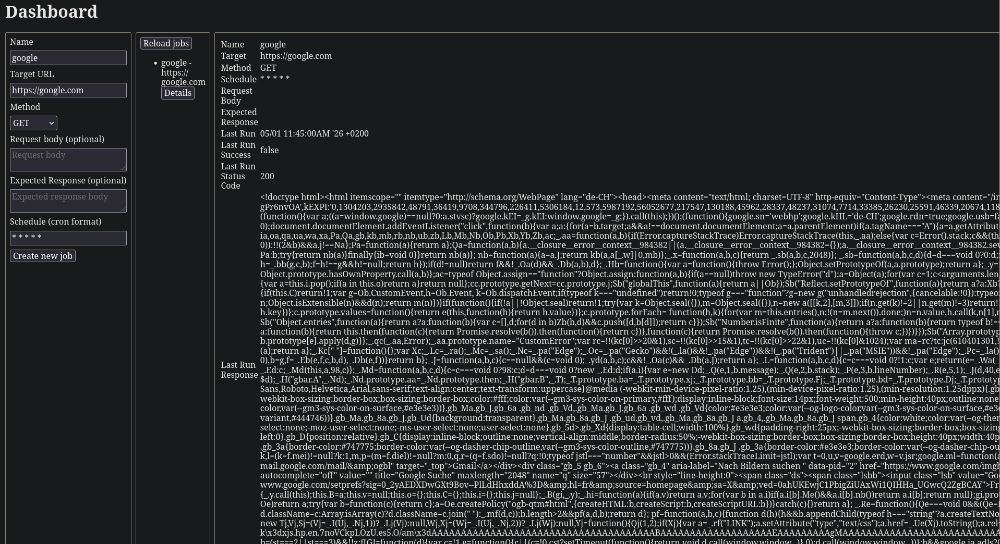

# Kron
This service can be used to check the state of stateless, non-daeomonized and worker type apps in a simple way.

The app or the user can specify an http request to be made, and Kron will make that request and if it doesn't recieve the expected response, notify the user.

This can be used as a healthcheck, cron job manager, etc.

# Some random stuff
I made this using pocketbase and htmx. 
Pocketbase is an all-in-one backend, primarily for frontend centric apps, but I severely abused it to make a "frontendless" app. That means, that the backend only sends html snippets, and the only job of the frontend is to swap them in into the DOM.
It could even work without htmx, but I added it to make it at least a little modern.

# How to use
Ya can log in with any email and a password and it'll create a user for you, then you can add jobs, where cron is mandatory (use `* * * * *` if you can't be bothered to think). If you don't provide an expected response, it will always succeed, if you add anything, it will remove whitespaces before comparison.
You need to click details again to refresh it, I haven't yet added autorefresh.

# Screenshots
